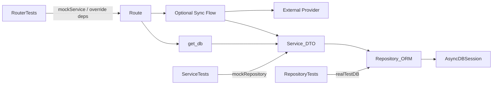

# FastAPI Skill Structure

## Purpose

This document defines how the FastAPI skill is organized and how references must be invoked before implementation.

Use this as the navigation and enforcement map for `SKILL.md` and all docs in `references/`.

This structure must be applied both at the start of the turn and again whenever
the implementation expands into a new layer or boundary during the same turn.

## Document Map

### Architecture & Cross-App
- [references/architecture-layers.md](references/architecture-layers.md): 4-layer model, exact `core/` definition, dependency rules, deployment model.
- [references/protocols.md](references/protocols.md): `typing.Protocol` usage, provider swapping, when to use vs skip.
- [references/capability-lifecycle.md](references/capability-lifecycle.md): 3-stage promotion (app-internal → shared → graduated app).
- [references/authentication.md](references/authentication.md): auth protocol, FastAPI auth dependencies, role-based access.

### Per-Layer Rules
- [SKILL.md](SKILL.md): global protocol, mandatory invocation rules, and non-negotiable constraints.
- [references/routes.md](references/routes.md): HTTP translation layer rules.
- [references/services.md](references/services.md): business logic, DTO service contracts, and flow boundaries.
- [references/module-isolation.md](references/module-isolation.md): cross-module boundaries and facade rules.
- [references/repositories.md](references/repositories.md): persistence rules and update semantics.
- [references/database-setup.md](references/database-setup.md): engine/session/transaction standards.
- [references/schemas-models.md](references/schemas-models.md): DTO/model responsibilities and update DTO design.
- [references/dependencies.md](references/dependencies.md): FastAPI dependency adapters and their boundary with the container.
- [references/scoped-resources.md](references/scoped-resources.md): request/job-scoped resource ownership patterns.
- [references/testing.md](references/testing.md): test architecture and mocking matrix.
- [references/logging.md](references/logging.md): structured logging, correlation IDs, per-layer logging rules, sensitive data handling.
- [references/exceptions-enums.md](references/exceptions-enums.md): exception ownership and enum location.
- [references/examples.md](references/examples.md): end-to-end behavior examples.
- [references/scaffolds.md](references/scaffolds.md): one-time bootstrap patterns for new apps/modules. Not an ongoing reference.

## Mandatory Invocation Matrix

Before implementing, call references based on task type:

- **New app / new module / deciding where code lives**
  - Required: [references/architecture-layers.md](references/architecture-layers.md)
  - Also required: [references/capability-lifecycle.md](references/capability-lifecycle.md) when promoting capability across boundaries
- **Protocol / provider swap / infrastructure adapter**
  - Required: [references/protocols.md](references/protocols.md)
  - Also required: [references/architecture-layers.md](references/architecture-layers.md) for layer placement
- **Authentication / authorization / protected routes**
  - Required: [references/authentication.md](references/authentication.md)
- **Route change**
  - Required: [references/routes.md](references/routes.md)
- **Service change**
  - Required: [references/services.md](references/services.md)
  - Also required: [references/module-isolation.md](references/module-isolation.md) when another module is involved
- **Repository change**
  - Required: [references/repositories.md](references/repositories.md)
  - Also required: [references/database-setup.md](references/database-setup.md) when transaction behavior is relevant
- **Schema/DTO change**
  - Required: [references/schemas-models.md](references/schemas-models.md)
  - Also required: [references/repositories.md](references/repositories.md) for update semantics
- **FastAPI dependency / request resolution change**
  - Required: [references/dependencies.md](references/dependencies.md)
  - Also required: [references/database-setup.md](references/database-setup.md) when request DB access is part of the change
  - Also required: [references/scoped-resources.md](references/scoped-resources.md) when DB/resource ownership is part of the change
- **Logging / correlation IDs / structured output / sensitive data in logs**
  - Required: [references/logging.md](references/logging.md)
  - Also required: layer doc being logged in ([references/routes.md](references/routes.md) / [references/services.md](references/services.md) / [references/repositories.md](references/repositories.md))
- **Test change**
  - Required: [references/testing.md](references/testing.md)
  - Also required: layer doc under test ([references/routes.md](references/routes.md) / [references/services.md](references/services.md) / [references/repositories.md](references/repositories.md))

## Mid-Turn Re-Invocation

Re-run the matrix when any of these happen mid-turn:

- a route-only change becomes a route + flow or route + service change
- a service change starts touching task entrypoints or container composition
- you introduce or move `build_*` functions
- you change who owns transaction/session boundaries
- you add a new file for wiring/composition

In those cases, do not keep editing from memory. Re-open the newly relevant
references first.

## Architecture Contracts

### Four-Layer Contract

```
core/           → fixed app primitives and fixed technology choices
domain/         → NOTHING (pure models, protocols)
shared/         → domain/ only (protocols, DTOs, thin helpers)
infrastructure/ → shared/ + domain/ (implements protocols)
apps/           → core/ + all layers, NEVER other apps
```

### Layering Contract (within an app)

`route -> service -> repository -> db`

- Routes parse and map transport concerns only.
- Services: business logic and orchestration within one unit of work.
- Repositories: persistence access only.
- `get_db()` from `src/container/core/dependencies.py` or a flow-local `sessionmanager.session()` block: transaction/session lifetime only.

### DTO Contract

- Service public methods must receive DTOs and return DTOs.
- Repositories return ORM entities to services.
- Services convert ORM to DTO at boundary.
- All project Pydantic DTOs live in schema modules.
- All project DTOs inherit from `src.core.schemas.BaseModel` or `src.core.schemas.ReadModel`.
- `ReadModel` is for object-to-DTO validation via `model_validate(obj)` when the source shape matches the DTO.

### Module Isolation Contract

- One module cannot call another module's repository directly.
- Cross-module writes/reads go through service public methods.
- Facade/orchestrator services are the approved pattern for multi-module workflows.

### Update Method Contract

- Repository updates must use:
  - `model_dump(exclude_unset=True)`
  - `setattr` loop over provided fields
  - `flush`
- DTO fields with special handling must use `Field(exclude=True)` and be processed in service logic.

### Transaction Contract

- No `commit`/`rollback` in routes/services/repositories.
- Request transaction scope is controlled by `get_db()` from `src/container/core/dependencies.py`.
- Task/flow transaction scope is controlled by `sessionmanager.session()`.
- Slow external/provider/LLM calls must sit outside any held DB session.
- Commit-boundary changes usually imply `references/scoped-resources.md` and
  `references/database-setup.md` must be re-read before continuing.
- Re-read `references/dependencies.md` too when the commit-boundary change also
  touches FastAPI dependency modules or route-to-container adaptation.

### Import Surface Contract

- Container package `__init__.py` files are not export barrels. Keep
  `src/container/__init__.py` and `src/container/core/__init__.py` empty unless
  a narrow package-level concern justifies otherwise.
- Import concrete container modules directly, for example
  `src.container.actions`, `src.container.core.dependencies`, and
  `src.container.lifecycle`.
- Stable `core` package exports are acceptable for fixed primitives/settings
  only. Do not re-export composition builders, lifecycle wrappers, app services,
  or FastAPI dependency adapters from `core` package `__init__.py` files.

## Test Matrix and DB Interplay

- Router tests mock services or auth dependencies through dependency overrides.
- Service tests mock repositories.
- Repository tests hit real test DB/session fixtures (no DB mocking).
- Root `tests/conftest.py` aggregates module fixtures via `pytest_plugins`.
- Per-module `fixtures.py` keeps dependencies local and explicit.

## Good vs Bad Catalog Index

Reference where examples live:

- Architecture layer decisions: [references/architecture-layers.md](references/architecture-layers.md)
- Protocol contracts and swapping: [references/protocols.md](references/protocols.md)
- Capability promotion: [references/capability-lifecycle.md](references/capability-lifecycle.md)
- Authentication and authorization: [references/authentication.md](references/authentication.md)
- Service DTO in/out and boundary rules: [references/services.md](references/services.md)
- Update method and excluded fields: [references/repositories.md](references/repositories.md), [references/schemas-models.md](references/schemas-models.md)
- DB creation and transaction control: [references/database-setup.md](references/database-setup.md)
- FastAPI dependency adapters and scoped lifetimes: [references/dependencies.md](references/dependencies.md), [references/scoped-resources.md](references/scoped-resources.md)
- Test layering and mocking strategy: [references/testing.md](references/testing.md)
- Module coupling vs facade flow: [references/module-isolation.md](references/module-isolation.md)
- Logging per layer, correlation IDs, sensitive data: [references/logging.md](references/logging.md)

## System Diagram


